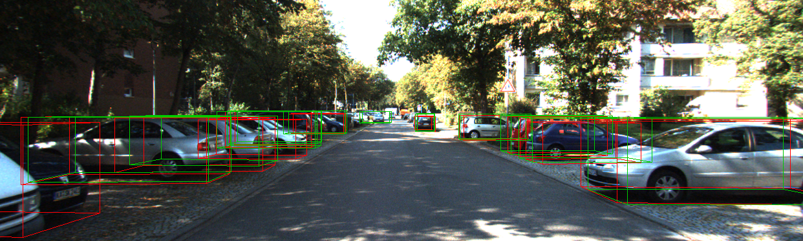

# UM3D_TUM
This is a implementation of the thesis "Monocular 3D Object Detection by Key-points", For more details please see my thesis.

## Introduction
This detector is a real-time monocular detector for autonomous drving. The runing time on a single NVIDA TITAN XP GPU is about 0.035s.
Additionly, we use uncertainty estimation and feature selection module to improve the final precision on KITTI benchmark. 
## Main results
The performance on KITTI 3D detection (3D/BEV) is as follows:

|             |     Easy      |    Moderate    |     Hard     |
|-------------|:-------------:|:--------------:|:------------:|
| Car         | 15.30  / 23.63 | 11.13 / 16.69   | 9.31 / 14.17 | 
| Pedestrian  | 3.49  / 3.60  | 1.74 / 1.79    | 1.74 / 1.79  | 
| Cyclist     | 0.45  / 0.62  | 0.45 / 0.62    | 0.45 / 0.62  |
## Requirements
*   Ubuntu 16.04
*   Python 3.7
*   Pytorch 0.4 (recommand) or 1.4
*   CUDA 9.0
## File-structure
This code retains implementations of some other methods (IOU loss, muti-keypoints, also including ablation, but not completely.) during my master-thesis. 
The source code of the final thesis version is src_uncertain_dist
```
      source_root
              │   
              │── data
              │    
              │── src
              │    
              │── src_9key
              │        
              │── src_iou
              │
              │── src_locf
              │
              │── src_uncertain_dist
              │
              │── experiment
              │
              │── exp
              │
              └──requirement.txt
              
           
```
## Dataset

We train and test our model on official [KITTI 3D Object Dataset](http://www.cvlibs.net/datasets/kitti/eval_object.php?obj_benchmark=3d). 
Please first download the dataset and organize it as following structure:
```
source_root/data
              │   
              kitti
              │──training
              │    ├──calib 
              │    ├──label_2 
              │    └──image_2 
              │
              │──testing
              │     ├──calib 
              │     └──image_2
              │
              │──ImageSets_x
              │        ├──train.txt
              │        ├──val.txt
              │        └──test.txt
              │
              └──annotations
```  
you can use the source_root/src_uncertainty/tools/convert_kitti_to_coco.py to split the whole trainint data to a specify ImageSet_x according to the image index in files：train.txt and val.txt. 

## Installation
1. Install pytorch 0.4.1. 
    Notebly,Due to [this issue](https://github.com/xingyizhou/pytorch-pose-hg-3d/issues/16)) ,we need make cudnn batch normalizationd disable.   ~~~
    ~~~
    # PYTORCH=/path/to/pytorch # 
    # for pytorch v0.4.0
    sed -i "1194s/torch\.backends\.cudnn\.enabled/False/g" ${PYTORCH}/torch/nn/functional.py
    # for pytorch v0.4.1
    sed -i "1254s/torch\.backends\.cudnn\.enabled/False/g" ${PYTORCH}/torch/nn/functional.py
    ~~~
2. Install [COCOAPI](https://github.com/cocodataset/cocoapi):
    ~~~
    # COCOAPI=/path/to/clone/cocoapi
    git clone https://github.com/cocodataset/cocoapi.git $COCOAPI
    cd $COCOAPI/PythonAPI
    make
    python setup.py install --user
    ~~~
 3. Install source 
    ~~~
    unzip source.zip 
    ~~~
 4. Install requirements.
    ~~~
    cd  #path_source
    pip install -r requirements.txt
    ~~~
 5. Compile deformable convolutional (from [DCNv2](https://github.com/CharlesShang/DCNv2/tree/pytorch_0.4)).
    ~~~
    cd $/src/lib/models/networks/DCNv2
    ./make.sh
    ~~~
## Preparing Data
   ~~~
   python source_root/src_uncertainty/tools/convert_kitti_to_coco.py
   ~~~
## Usage
   All the experiments are in the experiments folder.
   Training and Testing:
   ~~~
   . experiments/ddd_uncertain_dist.sh
   ~~~
   if you just want test, you can comment the train code in dd_uncertain_dist.sh
## Pretrained model
  The pretrained weights can be downloaded [here](https://drive.google.com/file/d/1KPOecVhu_EsLqxFs4hDYSrrQZE3Q5pQe/view?usp=sharing).
## License
UM3D_TUM itself is released under the MIT License (refer to the LICENSE file for details). 
Portions of the code are borrowed from [CenterNet](https://github.com/xingyizhou/CenterNet/), [DCNv2](https://github.com/CharlesShang/DCNv2)(deformable convolutions)
Please refer to the original License of these projects.
